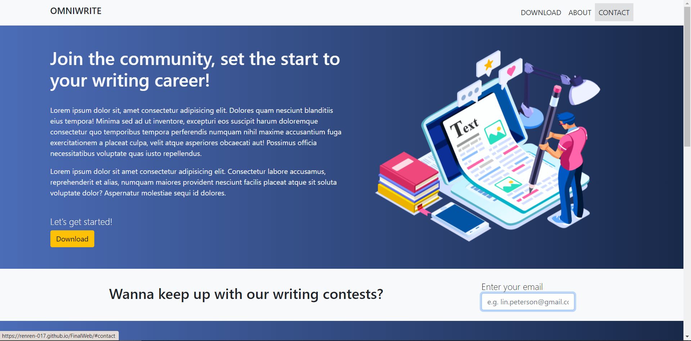

# Simple Web Project for (non-existing) writing app

Toggle-Button             |  Retrieved rows
:-------------------------:|:-------------------------:
  |  

## Structure

Responsive heading  
Basic information about the app + floating image representing the software  
Sign-up for newsletter section

Short info about the app pros wrapped in cards

Footer with a form to sign up

### Languages used  

### Framework  

